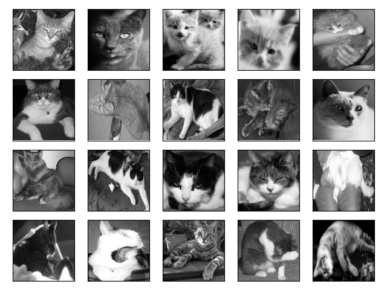
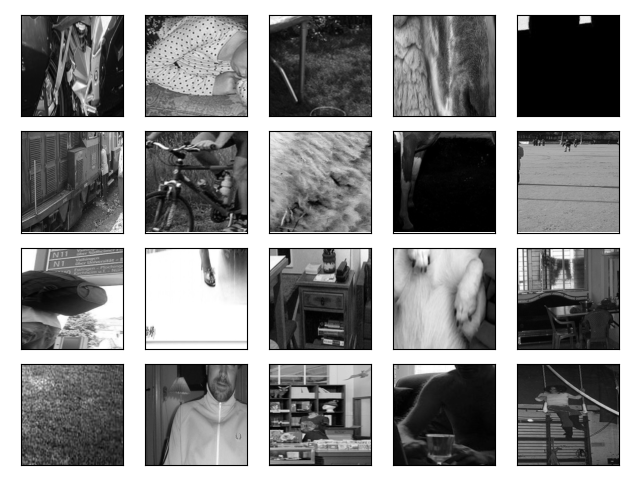
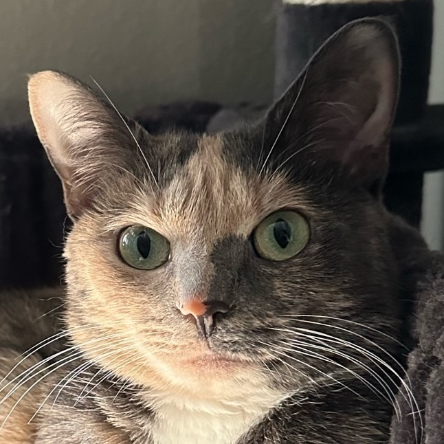
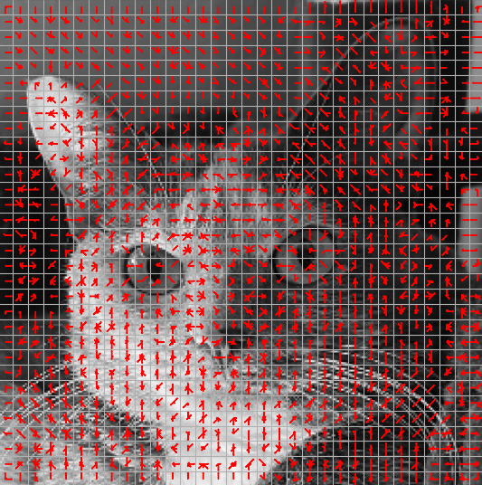
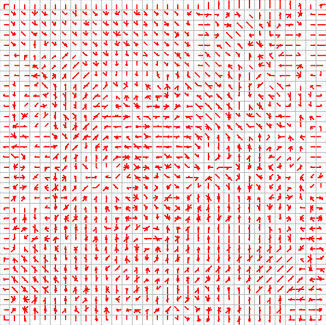
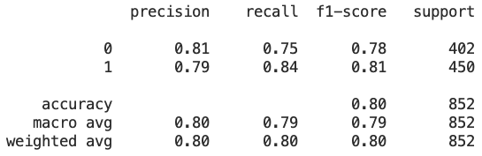

## Project Name 
HOG Cat Detection  

## Summary
Using the Histogram of Oriented Gradients descriptor, determined whether image contains a cat
or not.

## Steps
0. Obtain data from PASCAL VOC 2012 and get positive (cat) and negative (no cat)
images. 
 

1. Take x, y image gradients.  
2. Compute magnitude and orientation of gradient at each pixel location.  
3. Group pixels into cells (e.g. cell= 8 pixels $\times$ 8 pixels).  
4. For each cell, create a histogram of gradient orientation weighted by magnitude.  

5. Group the cells into overlapping blocks (e.g. 2 cells $\times$ 2 cells).  
6. For each block, concatenate the histograms into a single vector and normalize the obtained vector.  
7. Concatenate the block vectors and obtain a feature vector for the image.
8. Train and test with SVM.

